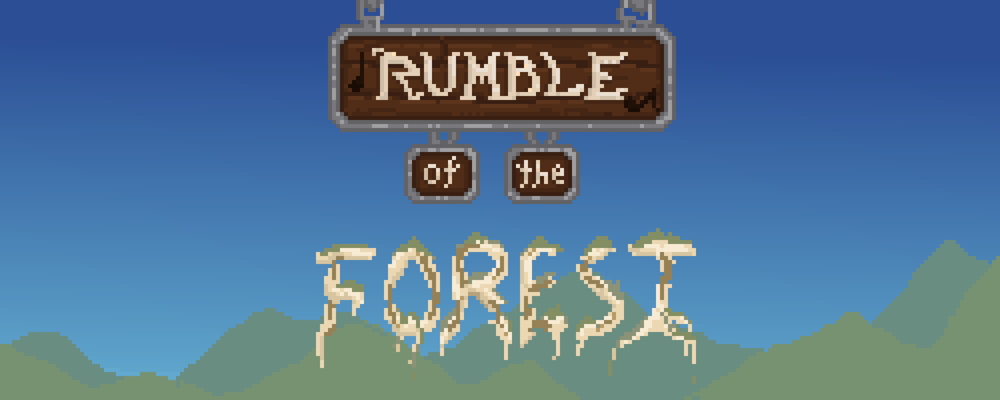
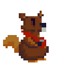
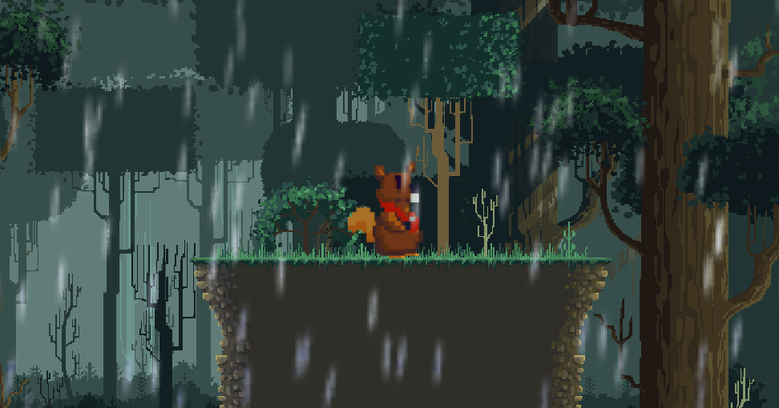
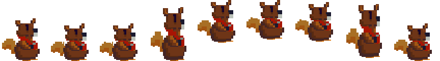
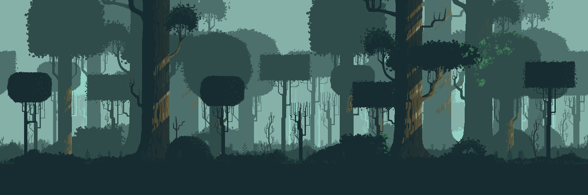

# **Rumble of the Forest**

## **Chronicle Games**

---

####   Ivan Diaz - A01365801
####   Joshua Amaya - A01025258
####   Octavio Fenollosa - A01781042
####   Emilio Sibaja - A01025139

---

## _Game Design Document_

---

##### **Copyright notice / author information / boring legal stuff nobody likes**

##
## _Index_

---

1. [Index](#index)
2. [Game Design](#game-design)
    1. [Summary](#summary)
    2. [Gameplay](#gameplay)
    3. [Mindset](#mindset)
3. [Technical](#technical)
    1. [Screens](#screens)
    2. [Controls](#controls)
    3. [Mechanics](#mechanics)
4. [Level Design](#level-design)
    1. [Themes](#themes)
        1. Ambience
        2. Objects
            1. Ambient
            2. Interactive
        3. Challenges
    2. [Game Flow](#game-flow)
5. [Development](#development)
    1. [Abstract Classes](#abstract-classes--components)
    2. [Derived Classes](#derived-classes--component-compositions)
6. [Graphics](#graphics)
    1. [Style Attributes](#style-attributes)
    2. [Graphics Needed](#graphics-needed)
7. [Sounds/Music](#soundsmusic)
    1. [Style Attributes](#style-attributes-1)
    2. [Sounds Needed](#sounds-needed)
    3. [Music Needed](#music-needed)
8. [Schedule](#schedule)

## _Game Design_

---

### **Summary**

Our game is about how the main character (Chubby the squirrel) overcome adversity through music and rhythm. It is a 2D, pixel art, platform and rhythm game.

### **Gameplay**

The goal of the game is to get all the instruments to bring harmony and peace to the forest, using them to the beat of the music to activate their powers. 

The enemies will try to take out the main player troughout the levels by either wearing down the life bar by reaching him or using abilities to slow him down to prevent the protagonist from defeating the level boss in a musical duel.

### **Mindset**

We want the player to go through various feelings through out the game. At the start, where the ploblems begin, the player is intended to feel nervous and empathetic to the main character. At mid game the player should feel adventurous after beating the first level knowing most of the mechanics. And at the end, the player must feel powerful while being in the last level and anxious to beat the final boss.

## _Technical_

---

### **Screens**

1. Title Screen
    1. Options
2. Level Select
3. Game
    1. Inventory
    2. Assessment / Next Level
4. End Credits

### **Controls**

The player will move with the arrow keys to go left, right and jump. For the player to attack, the keys A, S, D will be used to do normal and special attacks. And to keep our charater and the forest alive, the player must press the space bar following the rhythm of the music that is playing, this also heals the character if done correctly. Otherwise, the player will start to lose health until the character dies along with the forest.

### **Mechanics**

The player must go to the right, fighting moving enemies with the character's musical instrument (if the character touches an enemy it loses certain amount of health) and jumping platforms and static obstacles to finish the current level. At the end of each level, there will be a boss. In order to defeat it, the player must press a sequence of keys (Guitar Hero Style) as it will be indicated on the screen. For that we will make the key that has to be pressed fall in the screen and we'll use a line to guide the player when to press the key, and if most of the keys were pressed on the right moment, the player moves on to the next level (on the final level, a final scene and the credits will be shown instead).
If the player dies the current level will be restarted even if they get to the boss.

## _Level Design_

---

### **Themes**

1. Snowy Forest
    1. Mood
        1. Sad, cold, dangerous and dark
    2. Objects
        1. _Ambient_
            1. Snowfall
            2. Snowy trees
            3. Dead Trees
            4. Small snow creatures
            5. Variety of rocks
            
        2. _Interactive_
            1. Snow Fox
            2. Snow Crows
            3. Mixtli (Level Boss)
            
2. Rainy Forest
    1. Mood
        1. Tense, wild, active, grey
    2. Objects
        1. _Ambient_
            1. Bushes
            2. Tall Grass
            3. Dead trees
            4. Dead bushes
            5. Water puddles

        2. _Interactive_
            1. Grey Fox
            2. Crows
            3. Grey Worms
            4. Tlacuatzin (Level Boss)

3. Happy Forest 
    1. Mood
        1. Happy, mischievous, "safe"
    2. Objects
        1. _Ambient_
            1. Flowers
            2. Butterflies
            3. Small forest creatures
            4. Bushes
            5. Lush trees

        2. _Interactive_
            1. Orange Fox
            2. Owls
            3. Pink Worms  
            4. Tenoch (Level Boss)     

### **Game Flow**

1. Start on grass.
2. Left wall, must move right.
3. Rhythm bar is shown.
4. Introduction of health mechanics.
5. After advancing, introduction to first NPC.
6. The NPC hands over the first instrument.
7. Tutorial on perfect note mechanics.
8. Instrument power tutorial.
9. Keep moving right, level theme song is introduced.
10. First enemy spawn.
11. Press the power key to hit the enemy.
12. Platforms and enemies appear.
13. Traverse through the level defeating enemies and avoiding obstacles.
14. Level boss room entrance.
15. Level boss appears on the right side of the screen.
16. Room is closed, change of boss interactions and movement.
17. Switch to perfect note mechanic.
18. Each successful note increases the basic power of the instrument; the boss can be attacked after mechanic
19. Level boss defeat.
20. Overall scene change.

## _Development_

---

### **Abstract Classes / Components**

1. BasePhysics
    1. BasePlayer
    2. BaseEnemy
    3. BaseObject
2. BaseObstacle
3. BaseInteractable

### **Derived Classes / Component Compositions**

1. BasePlayer
    1. PlayerMain
    2. PlayerHealth
    3. PlayerScore

2. BaseEnemy
    1. EnemyFox
    2. EnemyCrow
    3. EnemyOwl
    4. PinkWorms
   
3. BaseInstruments
    1. ObjectMarimba (pick-up-able, throwNotes)
    2. ObjectHandpan (pick-up-able, throwNotes)
    3. ObjectTarola (pick-up-able, throwNotes)

4. BaseObstacle
    1. ObstacleRock (jump)
    2. ObstacleWall (jump)
    
5. BaseBoss
    1. Miztli (level 1)
    2. Tlacuatzin (level 2)
    3. Tenoch (level 3)

6. PlayerPowers
    1. PowMarimba
    2. PowHandpan
    3. PowTarola

7. PrecisionScore
    1. PerfectNotes
    2. GoodNote

## _Graphics_

-Main Character (Chubby The Squirrel)

-Main character and a concept background

-Sprite sheet of the main character while jumping

-One of our dark backgrounds

### **Style Attributes**

At the start we'll be using dark colors and at the end light colors to represent the characters journey. All the graphic style is going to be pixel art with no black outlines. Animations will be played with the character movement, attack and when it takes damage

### **Graphics Needed**

1. Characters
    1. Main Characters
        1. Gordilla aka. Chubby (idle, walking, jumping, receiving damaged, dying)
        2. Miztli (idle, walking, attacking, receiving damaged, dying)
        3. Tlacuatzin (idle, walking, attacking, receiving damaged, dying)
        4. Tenoch (idle, walking, attacking,receiving damaged, dying)
    2. Fox
        1. White Fox (idle, walking, attacking, receiving damage, dying)
        2. Grey Fox (idle, walking, attacking, receiving damage, dying)
        3. Orange Fox (idle, walking, attacking, receiving damage, dying)

    3. Birds
        1. White Crow (idle, flying, attacking, receiving damage, dying)
        2. Grey Crow (idle, flying, attacking, receiving damage, dying)
        3. Owl (idle, flying, attacking, receiving damage, dying)

    4. Worm
        1. Grey Worm (idle, moving, attacking, receiving damage, dying)
        2. Pink Worm (idle, moving, attacking, receiving damage, dying)

2. Blocks
    1. Dirt
    2. Dirt/Grass
    3. Stone Block
    4. Snow
    5. Snow/Dirt
    6. Dead Grass

3. Ambient
    1. Tall Grass
    2. Rodent (idle, scurrying)
    3. Rocks
    4. Random animal bones
    5. Water puddles
    6. Butterflies
    7. Dancing flowers
    
4. Other
    1. Music Notes
    2. Attack graphics (proyectiles)
    3. Snare Drum
    4. Hand Pan
    5. Marimba

## _Sounds/Music_

---

### **Style Attributes**

Again, consistency is key. Define that consistency here. What kind of instruments do you want to use in your music? Any particular tempo, key? Influences, genre? Mood?

Stylistically, what kind of sound effects are you looking for? Do you want to exaggerate actions with lengthy, cartoony sounds (e.g. mario&#39;s jump), or use just enough to let the player know something happened (e.g. mega man&#39;s landing)? Going for realism? You can use the music style as a bit of a reference too.

 Remember, auditory feedback should stand out from the music and other sound effects so the player hears it well. Volume, panning, and frequency/pitch are all important aspects to consider in both music _and_ sounds - so plan accordingly!

### **Sounds Needed**

1. Effects
    1. Soft Footsteps (dirt floor)
    2. Sharper Footsteps (stone floor)
    3. Soft Landing (low vertical velocity)
    4. Hard Landing (high vertical velocity)

2. Feedback
    1. Relieved &quot;Ahhhh!&quot; (health)
    2. Shocked &quot;Ooomph!&quot; (attacked)
    3. Happy chime (extra life)
    4. Sad chime (died)

### **Music Needed**

1. Slow-paced, nerve-racking &quot;forest&quot; track
2. Exciting &quot;castle&quot; track
3. Creepy, slow &quot;dungeon&quot; track
4. Happy ending credits track
